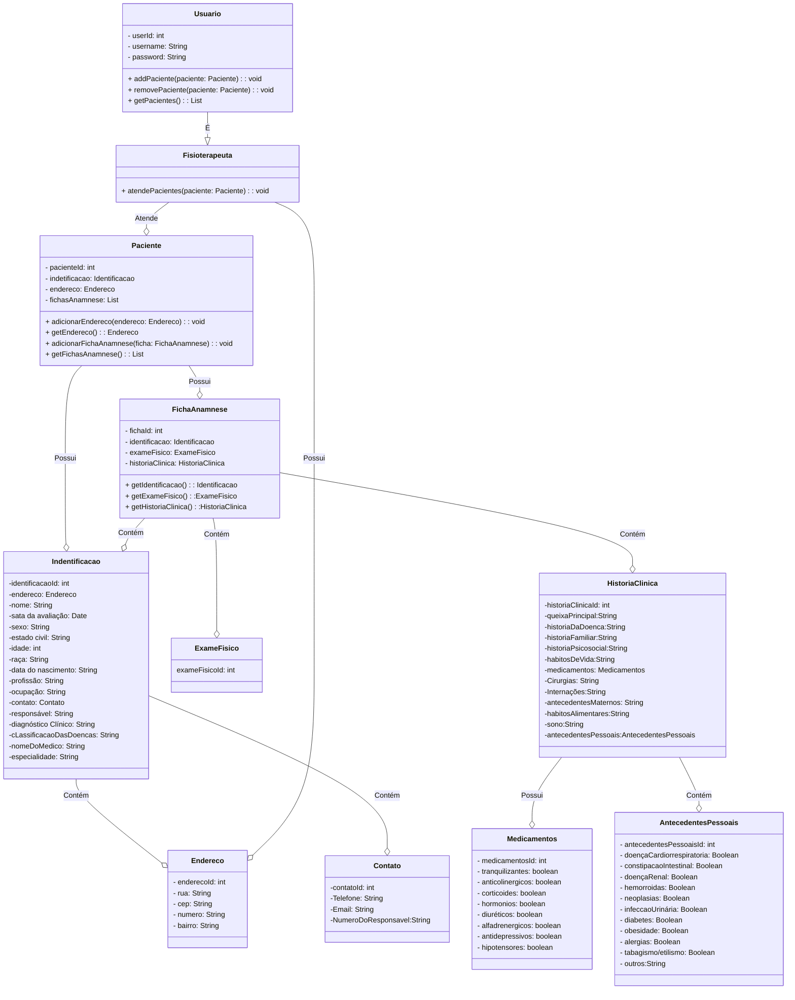

# Api-RestFull-FisioApp
Uma API Restful em Java com Spring Boot e autenticação JWT para gerenciar pacientes, casos clínicos e evoluções. Registre atendimentos com segurança e acompanhe o progresso dos tratamentos de forma eficiente. Ideal para fisioterapeutas que buscam organização e qualidade no atendimento.
Gerenciamento de Fisioterapia API Restful Java
Sistema de Gerenciamento de Atendimentos de Fisioterapeutas: Uma API Restful em Java com Spring Boot e autenticação JWT para simplificar o gerenciamento de pacientes, casos clínicos e evoluções. Registre atendimentos com segurança e acompanhe o progresso dos tratamentos de forma eficiente.

# Descrição
A API de Gerenciamento de Fisioterapia é uma solução completa para fisioterapeutas que desejam manter um registro detalhado de seus pacientes, casos clínicos e evoluções. Com autenticação segura e suporte a Java e Spring Boot, ela oferece um controle eficiente e organizado dos atendimentos.

# Funcionalidades
Cadastro de pacientes com informações detalhadas.
Registro de casos clínicos e evoluções.
Autenticação segura com JWT para acesso dos fisioterapeutas.
Acompanhamento do progresso do tratamento de cada paciente.
Fácil integração em sistemas de gestão de clínicas.
Pré-requisitos
Java JDK 11
Maven
Banco de Dados (por exemplo, MySQL)
Tecnologias Utilizadas
Java
Spring Boot
MySQL (ou outro banco de dados à sua escolha)

# Diagrama de classe 

